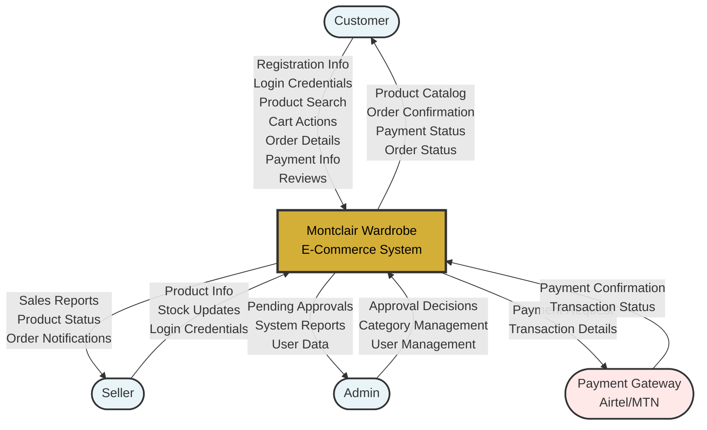
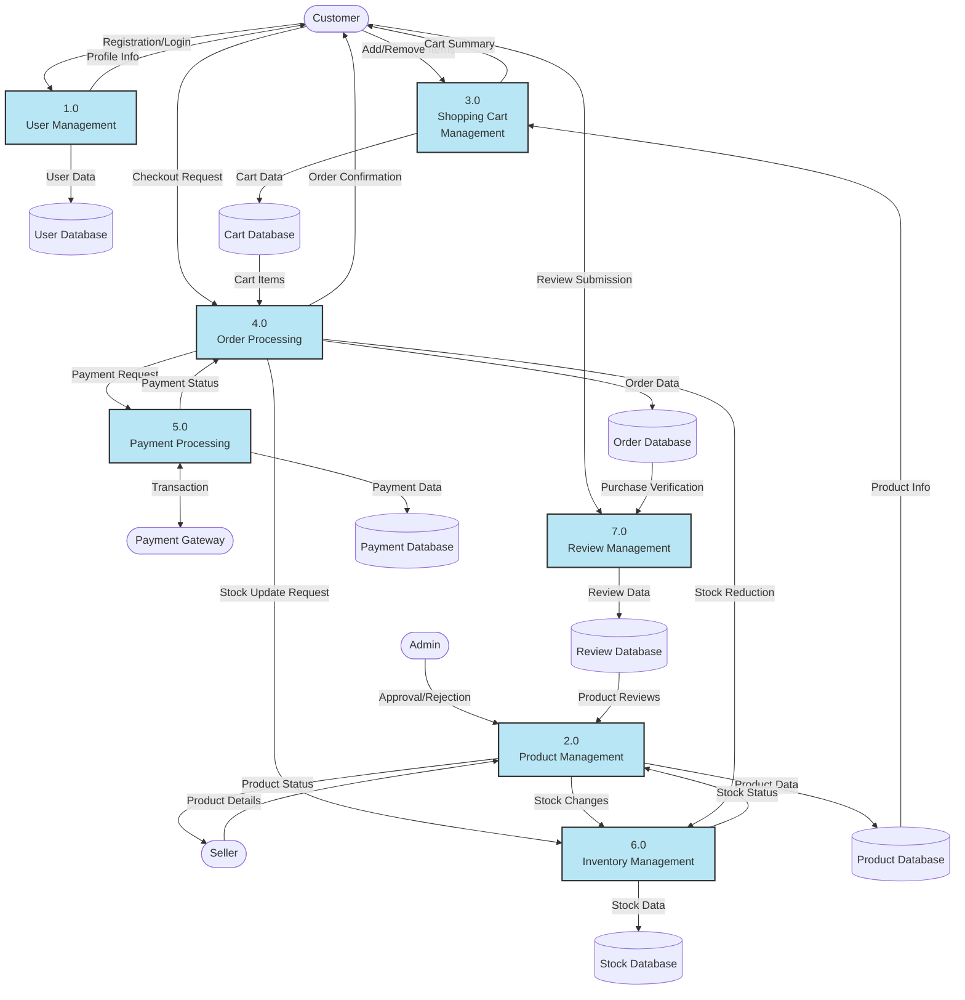
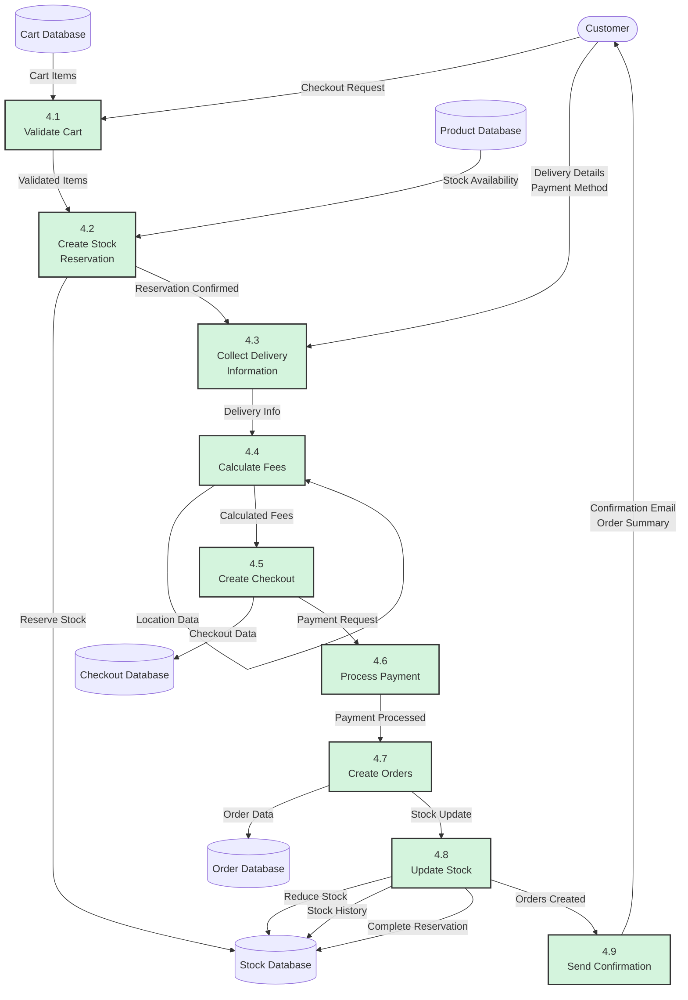
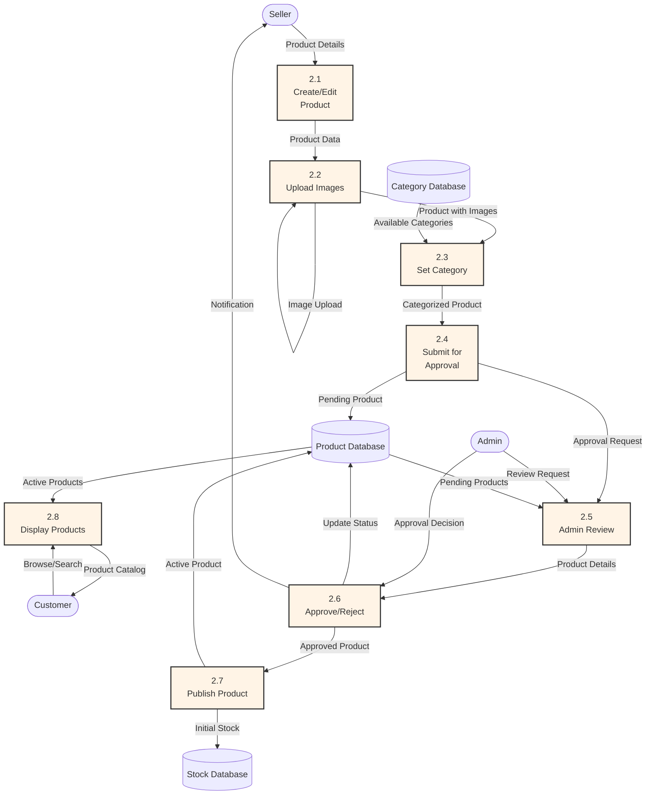
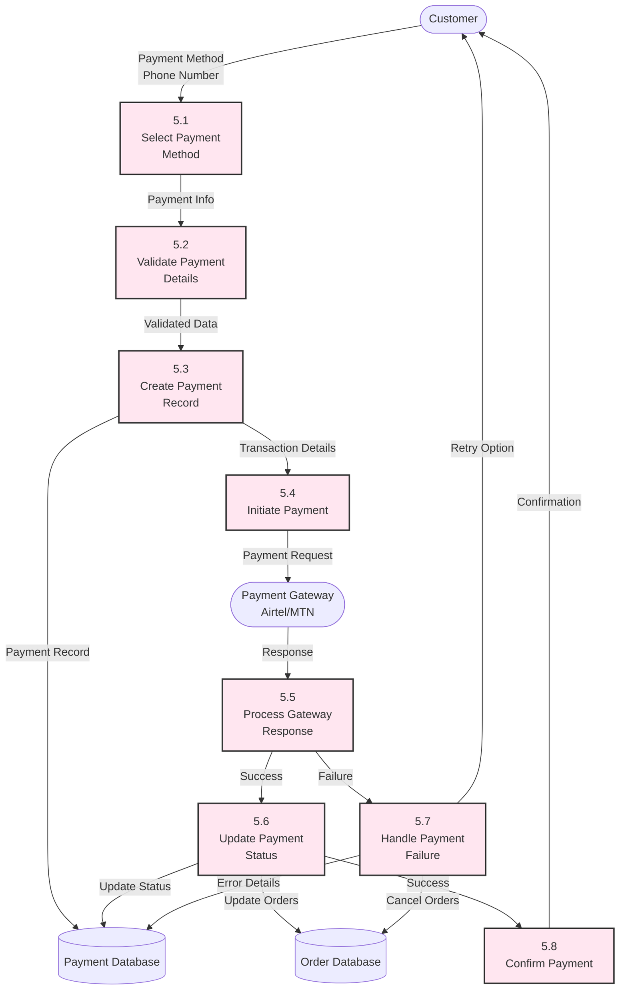
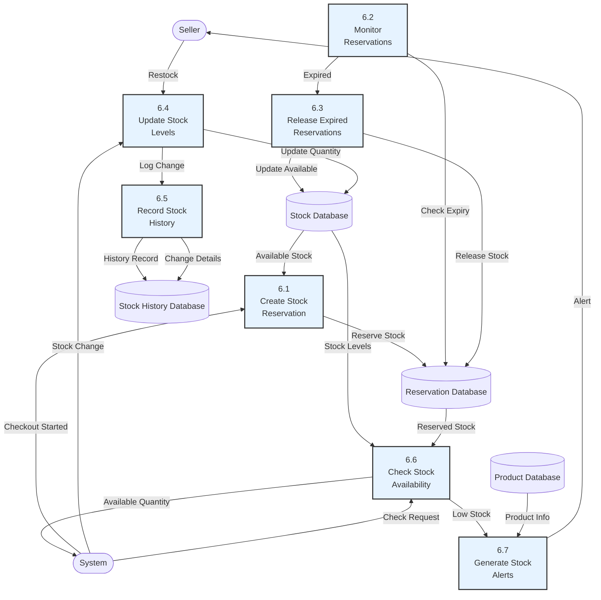
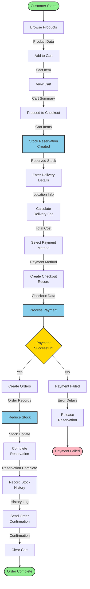

# Montclair Wardrobe E-Commerce System - Data Flow Diagram

## Overview

This document contains the Data Flow Diagrams (DFD) for the Montclair Wardrobe e-commerce system, showing how data flows through the system at different levels of abstraction.

---

## Context Diagram (Level 0)

The highest level view showing the system as a single process with external entities.

---

## Level 1 DFD - Main System Processes

Shows the major processes within the system.

---

## Level 2 DFD - Order Processing (Process 4.0)

Detailed view of the order processing workflow.

---

## Level 2 DFD - Product Management (Process 2.0)

Detailed view of product management workflow.

---

## Level 2 DFD - Payment Processing (Process 5.0)

Detailed view of payment processing workflow.

---

## Level 2 DFD - Inventory Management (Process 6.0)

Detailed view of inventory/stock management workflow.

---

## Complete Customer Purchase Flow

End-to-end data flow for a customer making a purchase.

---

## Data Stores Description

| Data Store | Description | Key Data Elements |
|------------|-------------|-------------------|
| **User Database** | Stores user account information | username, email, password, role, profile data |
| **Product Database** | Stores product catalog | name, description, price, status, approval_status, stock |
| **Category Database** | Stores product categories | name, description, created_by |
| **Cart Database** | Temporary shopping cart data | user_id, product_id, quantity, added_at |
| **Checkout Database** | Checkout session information | user_id, location, payment_method, delivery_fee, status |
| **Order Database** | Individual product orders | user_id, product_id, checkout_id, quantity, status |
| **Payment Database** | Payment transaction records | user_id, method, amount, reference, status |
| **Review Database** | Product reviews and ratings | product_id, user_id, rating, comment, verified |
| **Stock Database** | Current stock levels | product_id, quantity, last_updated |
| **Reservation Database** | Temporary stock reservations | user_id, product_id, quantity, expires_at, status |
| **Stock History Database** | Audit trail of stock changes | product_id, change_type, quantity_change, reason, timestamp |

---

## Data Flow Descriptions

### Main Data Flows

1. **User Registration Flow**
   - Customer → Registration Data → User Management → User Database
   - User Database → Profile Info → Customer

2. **Product Creation Flow**
   - Seller → Product Details → Product Management → Product Database
   - Product Database → Approval Request → Admin
   - Admin → Approval Decision → Product Database

3. **Shopping Flow**
   - Customer → Browse Request → Product Database → Product Catalog → Customer
   - Customer → Add to Cart → Cart Database
   - Cart Database → Cart Summary → Customer

4. **Checkout Flow**
   - Customer → Checkout Request → Order Processing
   - Cart Database → Cart Items → Order Processing
   - Order Processing → Stock Reservation → Stock Database
   - Customer → Delivery Details → Order Processing
   - Order Processing → Payment Request → Payment Processing
   - Payment Processing → Transaction → Payment Gateway
   - Payment Gateway → Confirmation → Payment Processing
   - Payment Processing → Payment Status → Order Processing
   - Order Processing → Create Orders → Order Database
   - Order Processing → Reduce Stock → Stock Database
   - Order Processing → Order Confirmation → Customer

5. **Review Flow**
   - Customer → Review Submission → Review Management
   - Order Database → Purchase Verification → Review Management
   - Review Management → Review Data → Review Database
   - Review Database → Product Reviews → Product Display

6. **Inventory Management Flow**
   - System → Stock Check → Inventory Management
   - Inventory Management → Stock Levels → Stock Database
   - Inventory Management → Stock History → Stock History Database
   - Seller → Restock → Inventory Management

---

## Process Descriptions

### Level 1 Processes

| Process | Name | Description |
|---------|------|-------------|
| **1.0** | User Management | Handles user registration, authentication, profile management |
| **2.0** | Product Management | Manages product creation, editing, approval, and display |
| **3.0** | Shopping Cart Management | Handles adding/removing items, cart display, cart updates |
| **4.0** | Order Processing | Processes checkout, creates orders, manages order lifecycle |
| **5.0** | Payment Processing | Handles payment method selection, processing, confirmation |
| **6.0** | Inventory Management | Manages stock levels, reservations, stock history |
| **7.0** | Review Management | Handles review submission, verification, display |

### Level 2 Processes (Order Processing)

| Process | Name | Description |
|---------|------|-------------|
| **4.1** | Validate Cart | Checks cart items availability and validity |
| **4.2** | Create Stock Reservation | Temporarily reserves stock for checkout |
| **4.3** | Collect Delivery Information | Gathers delivery address and contact details |
| **4.4** | Calculate Fees | Computes delivery fees based on location |
| **4.5** | Create Checkout | Creates checkout record with all details |
| **4.6** | Process Payment | Initiates and processes payment transaction |
| **4.7** | Create Orders | Creates individual order records for each product |
| **4.8** | Update Stock | Reduces stock and completes reservation |
| **4.9** | Send Confirmation | Sends order confirmation to customer |

---

## External Entities

| Entity | Description | Interactions |
|--------|-------------|--------------|
| **Customer** | End users who browse and purchase products | Browse, search, add to cart, checkout, review |
| **Seller** | Users who list products for sale | Create products, manage inventory, view sales |
| **Admin** | System administrators | Approve products, manage categories, manage users |
| **Payment Gateway** | External payment processing services (Airtel Money, MTN Mobile Money) | Process payments, return transaction status |

---

## Key Data Flows Summary

1. **Product Listing**: Seller → Product Data → System → Approval → Admin → Approved Product → Catalog
2. **Shopping**: Customer → Browse → Product Catalog → Add to Cart → Cart Summary
3. **Checkout**: Cart → Validate → Reserve Stock → Collect Info → Calculate Fees → Create Checkout
4. **Payment**: Checkout → Payment Request → Gateway → Confirmation → Order Creation
5. **Order Fulfillment**: Payment Success → Create Orders → Reduce Stock → Confirmation
6. **Review**: Purchase → Verification → Review Submission → Product Rating Update
7. **Inventory**: Stock Changes → History Log → Availability Check → Low Stock Alerts

---

## Notes

- All data flows are validated at each process step
- Stock reservations expire after 15 minutes if checkout is not completed
- Payment failures trigger automatic stock reservation release
- All stock changes are logged in stock history for audit purposes
- Reviews can only be submitted by verified purchasers
- Admin approval is required before products become visible to customers
