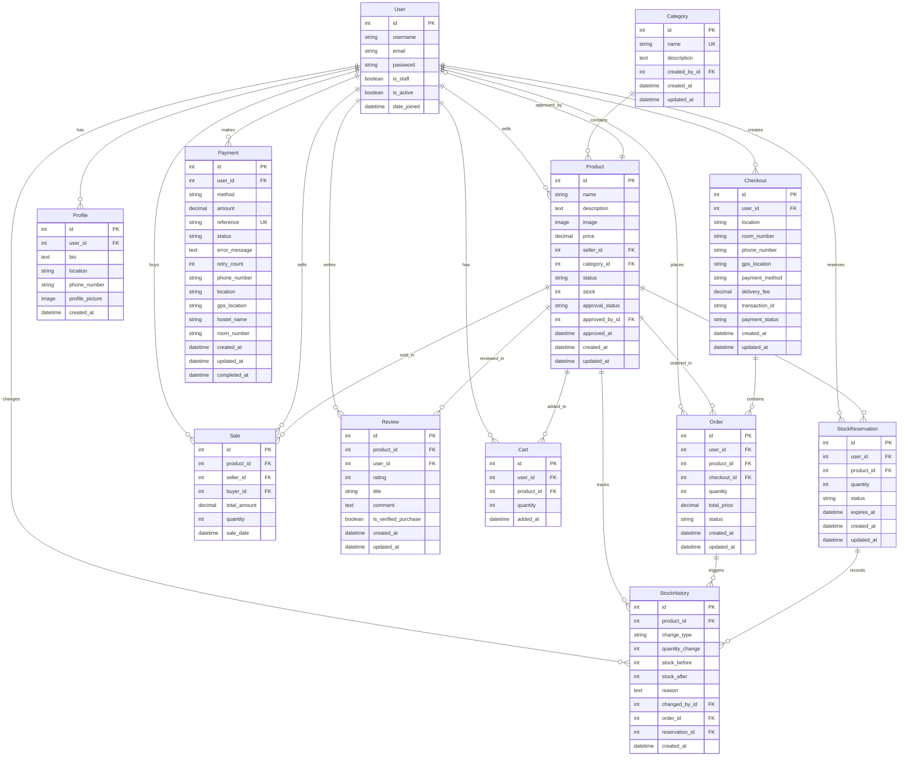

# Montclair Wardrobe E-Commerce System - Entity Relationship Diagram

## Database Schema Overview

This document contains the Entity Relationship Diagram (ERD) for the Montclair Wardrobe e-commerce system.

## ERD Diagram

## Entity Descriptions

### Core Entities

#### User (Django Auth)
- Built-in Django authentication user model
- Represents all system users (customers, sellers, admins)
- Related to multiple entities through various relationships

#### Profile
- One-to-one relationship with User
- Stores additional user information (bio, location, phone, profile picture)
- Extended user profile for customer/seller details

#### Category
- Product categorization system
- Created and managed by admin users
- Helps organize products into logical groups

#### Product
- Core entity representing items for sale
- Contains pricing, stock, and approval workflow
- Supports multi-status (active, inactive, sold, draft)
- Requires admin approval before being visible to customers

### Transaction Entities

#### Cart
- Temporary storage for products before checkout
- Unique constraint on user-product combination
- Tracks quantity for each product

#### Checkout
- Represents a checkout session
- Contains delivery and payment information
- Links to multiple orders
- Calculates delivery fees based on location

#### Order
- Individual product orders within a checkout
- Tracks order status (pending, processing, shipped, delivered, cancelled)
- Automatically reduces product stock on creation
- Links to checkout for grouping

#### Sale
- Historical record of completed transactions
- Tracks buyer-seller relationships
- Used for reporting and analytics

### Payment System

#### Payment
- Handles payment processing
- Supports multiple payment methods (Airtel, MTN, Cash, Stripe)
- Tracks payment status and retry attempts
- Stores payment reference for reconciliation

### Review System

#### Review
- Customer product reviews and ratings (1-5 stars)
- Supports verified purchase badges
- Unique constraint: one review per user per product
- Helps build trust and product quality feedback

### Inventory Management

#### StockReservation
- Temporary stock holds during checkout process
- Prevents overselling
- Auto-expires after set time (default 15 minutes)
- Tracks reservation status (active, completed, expired, cancelled)

#### StockHistory
- Audit trail for all stock changes
- Tracks who made changes and why
- Links to orders and reservations
- Supports various change types (restock, sale, return, adjustment, etc.)

## Key Relationships

### One-to-One
- User ↔ Profile

### One-to-Many
- User → Products (as seller)
- User → Orders
- User → Checkouts
- User → Reviews
- User → Cart Items
- User → Payments
- User → Stock Reservations
- Category → Products
- Product → Orders
- Product → Reviews
- Product → Cart Items
- Product → Stock Reservations
- Product → Stock History
- Checkout → Orders
- Order → Stock History
- StockReservation → Stock History

### Many-to-Many (through intermediary)
- User ↔ Product (through Cart)
- User ↔ Product (through Order)
- User ↔ Product (through Review)

## Business Rules

1. **Product Approval**: Products must be approved by admin before being visible to customers
2. **Stock Management**: Stock is automatically reduced when orders are created
3. **Stock Reservations**: Stock is temporarily reserved during checkout (15-minute expiry)
4. **Review Restrictions**: Users can only review products they have purchased
5. **Unique Reviews**: One review per user per product
6. **Delivery Fees**: Automatically calculated based on location (inside/outside campus)
7. **Payment Retry**: Failed payments can be retried up to 3 times
8. **Order Status Flow**: pending → processing → shipped → delivered
9. **Stock History**: All stock changes are logged for audit purposes

## Indexes

### Performance Optimization
- Product: (seller, status), (created_at)
- Order: (created_at)
- Review: (product, rating), (created_at)
- Payment: (user, status), (reference), (created_at)
- StockReservation: (user, status), (product, status), (expires_at, status)
- StockHistory: (product, created_at), (change_type, created_at), (changed_by, created_at)

## Status Enumerations

### Product Status
- `active`: Available for purchase
- `inactive`: Not available for purchase
- `sold`: Completely sold out
- `draft`: Not yet published

### Product Approval Status
- `pending`: Awaiting admin approval
- `approved`: Approved for sale
- `rejected`: Rejected by admin

### Order Status
- `pending`: Order placed, awaiting processing
- `processing`: Order being prepared
- `shipped`: Order shipped to customer
- `delivered`: Order delivered successfully
- `cancelled`: Order cancelled

### Payment Status
- `pending`: Payment initiated
- `processing`: Payment being processed
- `completed`: Payment successful
- `failed`: Payment failed
- `cancelled`: Payment cancelled

### Stock Reservation Status
- `active`: Reservation is active
- `completed`: Order placed, reservation fulfilled
- `expired`: Reservation time expired
- `cancelled`: Reservation cancelled by user

## Notes

- The system uses Django's built-in User model for authentication
- All monetary values use Decimal type for precision
- Timestamps are automatically managed (created_at, updated_at)
- Phone numbers are validated for Zambian format (+260XXXXXXXXX)
- Images are stored in organized directories by date (YYYY/MM/DD)
- The system supports both campus (inside/outside) and general delivery locations
